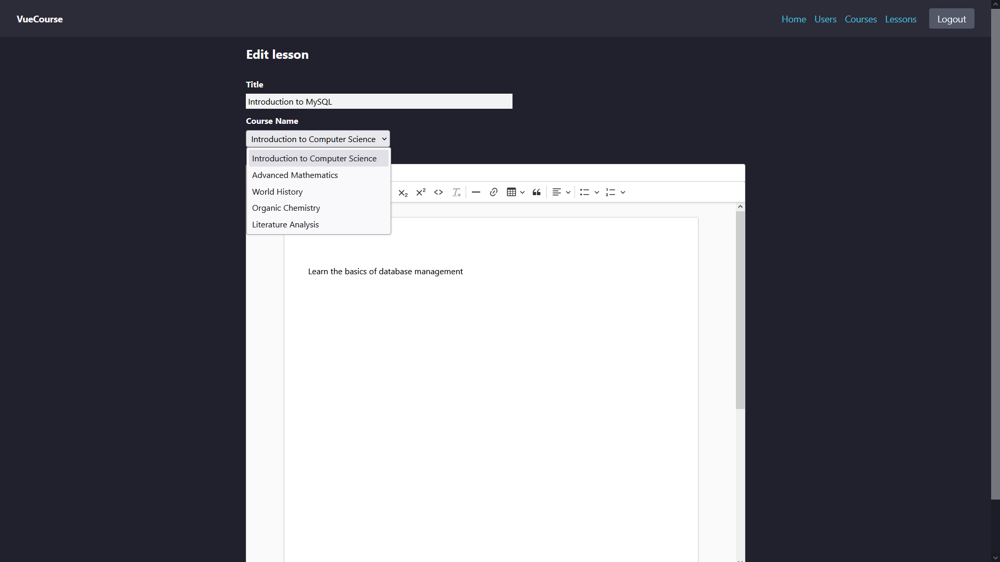

# VueCourse

VueCourse is a college assignment designed to showcase and combine the concepts learned in two courses. It's using Vue.js for the frontend, and Flask for the backend.

## Prerequisites:

- NodeJS (used v20.18.1)
- Python (used v3.13.1)
- MySQL Server (used v8.4)
- MySQL Workbench to execute `database.sql`

## Instructions:

- **Backend**

  - Open a terminal and navigate to the `backend` folder
  - Run the command `python -m venv myvenv`
  - On Windows: `myenv\Scripts\activate`
  - Now run `pip install -r requirements.txt`
  - To start Flask, run `python app.py`
  - If using VSCode: Press `Ctrl Shift P` > Python: Select Interpreter > Enter interpreter path... > Find > Navigate to `myenv` > Scripts > python.exe. You can now run app.py by pressing a button

- **Frontend**

  - Open a terminal and navigate to the `frontend` folder
  - Run `npm ci`
  - To start, use `npm run dev`

##

